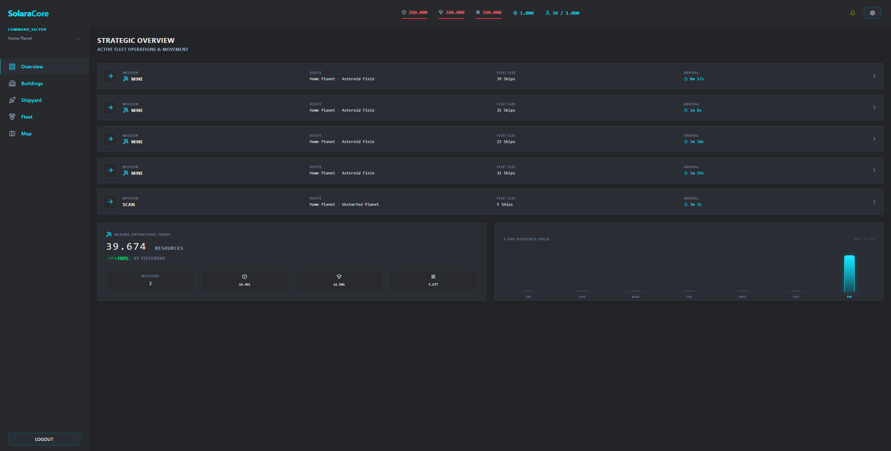
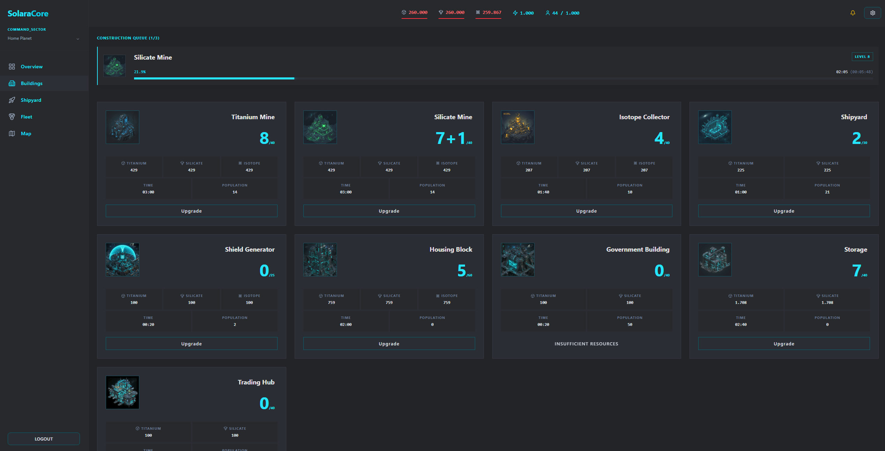
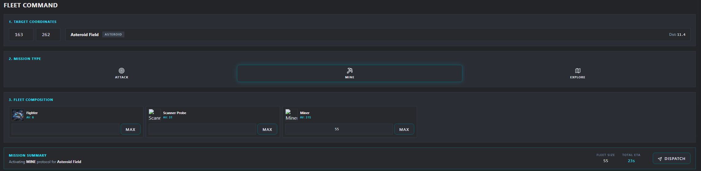

# Solara Core

Solara Core is a massive multiplayer sci-fi strategy game and technical showcase. It is currently in active development as a solo passion project. The project focuses on building a robust, highly concurrent architecture capable of handling complex background processing and thousands of simultaneous players before expanding the universe.



## Core Gameplay

Players manage planetary empires, balance intricate resource generation, and coordinate vast fleets in real-time across a seamless galaxy map. Every decision matters, from the layout of industrial sectors to the composition of orbital fleets.

<p align="center">
  
   
</p>

## Technical Stack

Built to scale, Solara Core utilizes a modern TypeScript stack to ensure type safety from the database to the client.

| Layer | Technology |
| --- | --- |
| **Frontend** | React, Vite, Tailwind CSS |
| **Backend** | Node.js, Express, TypeScript |
| **Database** | PostgreSQL (v15), Prisma ORM |
| **Authentication** | Clerk |
| **Proxy / SSL** | Nginx, Certbot |
| **Infrastructure** | Docker, Docker Compose |

## Getting Started

### Prerequisites

- Docker and Docker Compose installed on your system.
- A Clerk account for authentication keys.

### 1. Environment Configuration

Create a `.env` file in the root directory and add your Clerk credentials:

```env
CLERK_SECRET_KEY=your_secret_key_here
VITE_CLERK_PUBLISHABLE_KEY=your_publishable_key_here
```

### 2. Launch the Application

For development with hot-reloading (syncing local changes to containers):

```bash
docker-compose up --watch
```

This command automatically provisions:
- The React frontend (Vite)
- The Express backend API
- The PostgreSQL database
- Nginx reverse proxy and SSL management

### 3. Rebuilding

If you modify dependencies (`package.json`) or Docker configurations, a manual rebuild is required:

```bash
docker-compose build --no-cache
```

## Project Structure

```text
.
├── backend/            # Express API & background processing
├── frontend/           # React + Vite application
├── nginx/              # Proxy & SSL configuration
├── data/               # Persistent storage (DB & SSL)
├── .env                # Local secrets (Clerk keys)
└── docker-compose.yml  # Container orchestration
```

## Development Notes

1. **Domain Configuration**: The `nginx.conf` file is currently pre-configured for `solara-core.de`. For pure local development or alternative domains, update the `server_name` directive in `nginx/nginx.conf` and disable the Let's Encrypt blocks if not needed.
2. **Clerk Authentication**: The application will not function without valid Clerk keys in the `.env` file. Both frontend and backend rely on these keys to verify active sessions.
